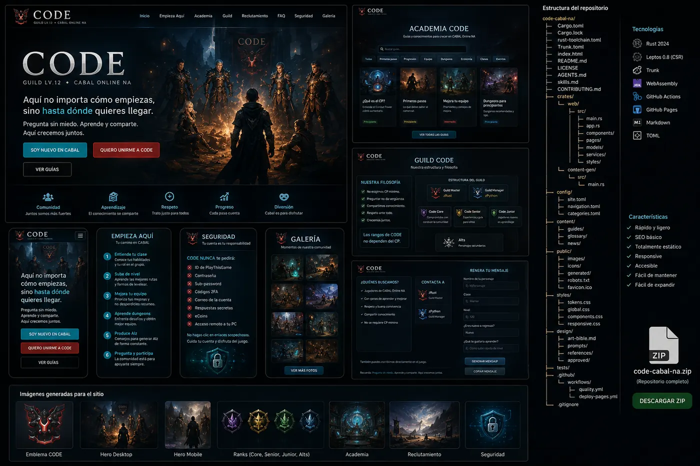

# CODE · Guild Lv.12 de CABAL Online NA

Sitio público y estático del guild **CODE**, construido con **Rust 2024**, **Leptos CSR**, **WebAssembly** y **Trunk**. El MVP presenta la identidad del guild, reclutamiento, Academia, preguntas frecuentes, seguridad y una galería.

> **Pregunta sin miedo. Aprende y comparte. Aquí crecemos juntos.**



## Qué incluye

- Inicio y ruta guiada para jugadores nuevos.
- Academia con búsqueda y filtros.
- Guías en Markdown embebidas en el binario.
- Filosofía y rangos `Core`, `Senior`, `Junior` y `Alts`.
- Generador local de mensaje de reclutamiento.
- Sección de seguridad sin formularios de cuenta.
- Imágenes originales creadas con ChatGPT Image Creator.
- Publicación automática en GitHub Pages.
- `AGENTS.md` y skills para agentes de IA y desarrolladores humanos.

## Requisitos

- Rust estable con soporte de Rust 2024. El proyecto declara MSRV 1.88.
- Target `wasm32-unknown-unknown`.
- Trunk 0.21.x.
- Python 3 para las validaciones de contenido.

## Primer inicio

```bash
rustup update stable
rustup target add wasm32-unknown-unknown
cargo install trunk --locked --version 0.21.14
python3 scripts/validate_content.py
trunk serve --open
```

La web quedará disponible en `http://127.0.0.1:8080`.

El primer comando de Cargo generará `Cargo.lock`. Al crear el repositorio definitivo, confírmalo en Git para fijar también las dependencias transitivas.

Si actualizas desde la entrega inicial `0.1.0`, aplica el parche de `0.1.1` o reemplaza `src/pages/home.rs`, `src/pages/guide.rs` y `Trunk.toml` con las versiones corregidas.

## Build de producción

```bash
trunk build --release
```

Los archivos listos para publicar se generan en `dist/`.

## Publicar gratis en GitHub Pages

1. Crea una organización, por ejemplo `code-cabal-na`.
2. Crea un repositorio público llamado `code-cabal-na.github.io`.
3. Copia este proyecto, confirma los cambios y haz `push` a `main`.
4. En **Settings → Pages → Build and deployment**, elige **GitHub Actions**.
5. El workflow `.github/workflows/deploy-pages.yml` compilará y publicará el sitio.

Si cambias el nombre o usas un repositorio de proyecto, actualiza:

- `Trunk.toml` → `public_url`.
- `public/sitemap.xml`.
- `public/robots.txt`.
- Los metadatos canónicos cuando agregues dominio propio.

## Agregar una guía

1. Crea `content/guides/mi-guia.md`.
2. Registra sus metadatos en `src/data/guides.rs`.
3. Ejecuta `python3 scripts/validate_content.py`.
4. Prueba búsqueda, filtros, ruta y enlaces relacionados.

Consulta `skills/content-authoring/SKILL.md` y `AGENTS.md` antes de editar contenido.

## Imágenes

Los activos publicados están en `public/images/`. La dirección visual, prompts y procedencia están en `design/`. No reemplaces una imagen sin actualizar `design/asset-manifest.toml`.

## Límites intencionales del MVP

No hay backend, cuentas, base de datos, panel administrativo, sincronización con el cliente de CABAL ni almacenamiento de formularios. El generador de reclutamiento funciona únicamente en el navegador y copia texto al portapapeles.

## Nota de propiedad intelectual

Este es un sitio creado por fans. No está afiliado, patrocinado ni administrado por ESTsoft o PlayThisGame. CABAL Online y sus marcas pertenecen a sus respectivos propietarios. Las imágenes promocionales del sitio son composiciones originales y no usan logotipos ni personajes oficiales.

## Licencia

Código bajo licencia MIT. El uso de screenshots aportados por el guild y del nombre/emblema de CODE queda sujeto a autorización de sus administradores.
